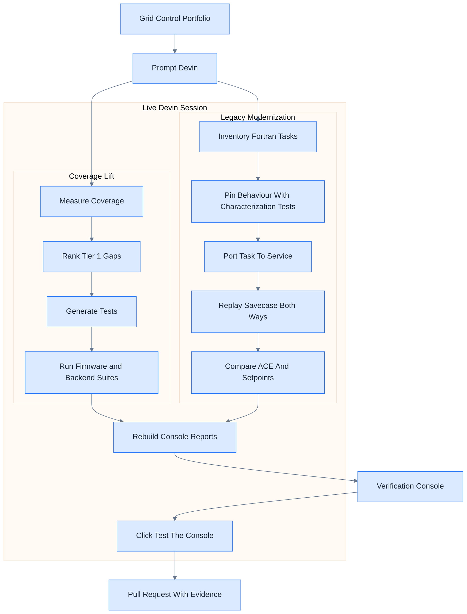
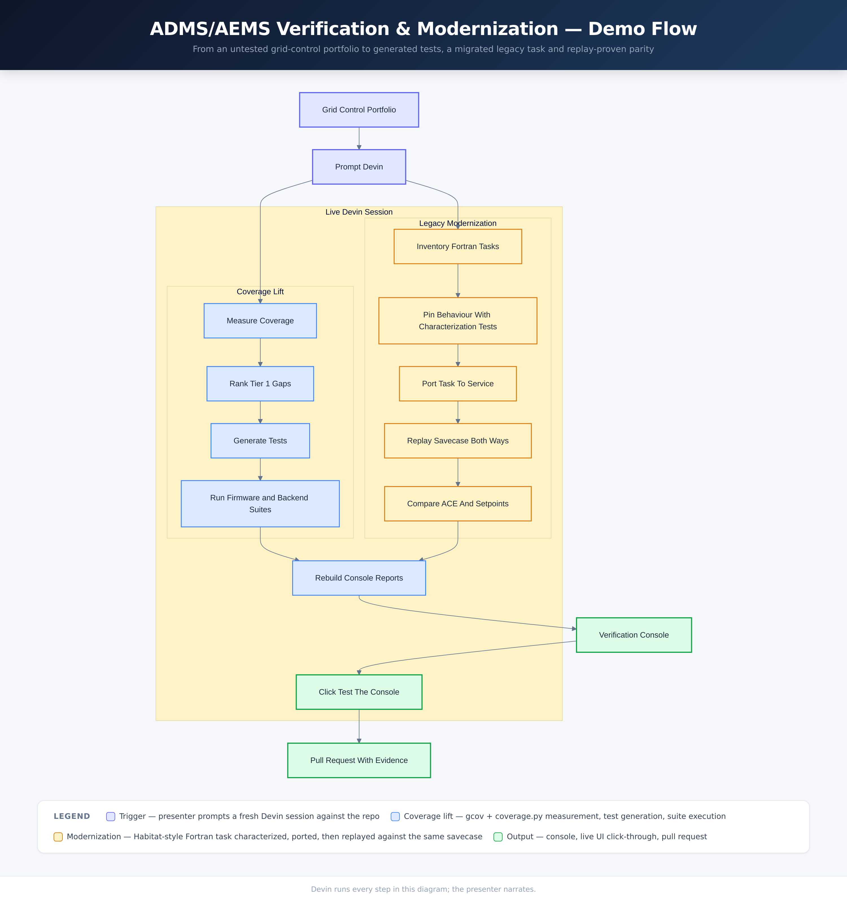

# ADMS/AEMS Test Automation &amp; Legacy Modernization Demo

A grid-control software portfolio — a real-time feeder protection IED with an integrated synchrophasor unit (C11 on an emulated STM32F407), ADMS/AEMS backend services and a legacy Habitat-style EMS application — with the test coverage it realistically has on day zero.



Full-page version: [`docs/flowchart.html`](docs/flowchart.html).

<details>
<summary>PNG fallback</summary>



</details>

## What this demo shows

Three code layers that a distribution/energy management portfolio really contains — C11
protection firmware, Python ADMS/AEMS services, and Fortran batch tasks running against an
HDB-style control-center database — measured honestly: **62.6% line coverage, but 18 of 26
modules below their release-gate target (11 of them Tier 1 protection and control code), and
zero characterization tests over the legacy tasks that are being rewritten.** The AGC service that is supposed to replace the legacy
`RTGENACE` task has no tests at all, and the underfrequency load-shedding task has no modern
counterpart yet.

The console makes both problems visible in one place: where coverage is missing, and which
legacy tasks are being ported without their behaviour pinned first.

## The real-time IED

`firmware/` carries a feeder protection relay and P-class PMU written the way IED firmware is
actually written: C11, static allocation only, no heap, no RTOS dependency in the portable
core, and a hard cycle budget per task.

| Layer | What it does |
|---|---|
| Sample ISR, 1920 Hz (32 / cycle) | Reads 8 ADC channels into a lock-free ring, disciplines the sample clock to GPS PPS |
| Protection, 480 Hz | Full-cycle DFT phasors with DC-offset mimic filter, symmetrical components; 50P/50G/51P/51G (IEC + IEEE curves), 21 mho distance zones 1-2 with memory polarisation and k0 compensation, 50BF retrip and 86B bus lockout, trip matrix and SOE recorder |
| PMU, 60 fps | IEEE C37.118.1 P-class phasor, frequency and ROCOF estimation; 81U/81O/81R; C37.118.2 data frames with SOC/FRACSEC/STAT and CRC-CCITT |
| Comms, 120 Hz | DNP3 point update and SOE drain |

`firmware/target/stm32f407/` builds the same sources for a 168 MHz Cortex-M4F (hard-float,
`-Werror -Wdouble-promotion`), and `tools/run_renode.py` boots that ELF in Renode with an
on-chip secondary-injection test set closing the loop through the breaker. Each task is timed
with the DWT cycle counter; `tools/build_realtime_report.py` fails CI if any task exceeds its
budget in `firmware/include/ied_config.h` or a fault scenario operates the wrong element. The
console's **Real-time** tab shows worst-case cycles vs budget, the closed-loop scenario
results, and the C37.118.1 compliance matrix — where six of eight P-class tests, including
the off-nominal frequency range, have no automated check yet.

Renode is instruction-accurate, not cycle-accurate (no pipeline or flash wait-state model), so
the timing numbers are deterministic evidence of relative cost and headroom, not silicon
measurements.

## What Devin does live

In a single session Devin measures coverage across firmware and backend, ranks the gaps by
control function and release tier, generates and runs tests for the highest-risk untested
modules, writes characterization tests over a legacy Fortran task before touching it, ports
that task to the modern service, and proves equivalence by replaying the same savecase
(`RTNET_EMS_0742`) through the Fortran binary and the Python service and comparing Reporting
ACE and per-unit regulation setpoints. The audience watches the verification console update —
coverage bars, migration readiness, parity table — and then watches Devin click-test that
console in its own browser before it opens a PR.

## How the demo runs

Trigger: prompt a fresh Devin session against this repo, e.g.

> Lift verification coverage on the Tier 1 gaps and modernize `RTGENACE`: characterize the
> Fortran behaviour first, port it, then prove parity on the savecase and refresh the console.

Devin then, end to end: runs `tools/build_coverage_report.py` to measure the real state,
generates tests under `firmware/tests/` and `backend/tests/`, runs `make -C firmware test`
and `pytest`, writes characterization tests against the `make -C legacy/habitat replay`
output, ports the task, re-runs `tools/build_legacy_inventory.py` for the parity table,
rebuilds the console, and finishes with the mandatory UI gauntlet
(`.agents/skills/verification-console-gauntlet`) — `npx playwright test` plus an interactive
click-through in its own browser. Everything the audience sees is Devin's output; the
presenter narrates.

### Local development

```bash
pip install -e './backend[dev]' && pytest backend   # backend suite
make -C firmware test && make -C firmware coverage  # firmware suite + gcov
make -C firmware sim && ./firmware/build/ied_sim --list   # host secondary-injection simulator
python tools/run_renode.py --scenario fault_ag_zone1     # boot the STM32F407 image in Renode
python tools/build_realtime_report.py                    # all scenarios + budgets -> realtime.json
sudo apt-get install -y gfortran && make -C legacy/habitat replay
python tools/build_coverage_report.py --label baseline
python tools/build_legacy_inventory.py
npm --prefix console install && npm --prefix console run dev   # console on :3000
npm install && npx playwright install --with-deps chromium && npx playwright test
```

## Repo layout

```
firmware/        C11 feeder protection IED + PMU: dsp/ prot/ pmu/ rt/ ied/, STM32F407 target,
                 Renode platform, host simulator, secondary-injection test set (3 test files)
backend/         Python ADMS/AEMS services: FLISR, state estimation, AGC, savecase ingest (1 test file)
legacy/habitat/  Habitat-style EMS application: HDB schema, clone, savecase, Fortran tasks
tools/           Coverage merger, legacy inventory / parity replay, Renode runner, real-time report
console/         Verification console (React + TypeScript + Vite)
tests/ui/        Playwright gauntlet + UI_TEST_PLAN.md
docs/            Implementation plan and flowchart
```

## Key concepts

| Term | Meaning |
|---|---|
| ADMS / AEMS | Advanced distribution / energy management system — the control-room applications |
| FLISR | Fault location, isolation and service restoration |
| Reporting ACE | `(NIA − NIS) − 10B(FA − FS) − IME`, the NERC BAL-001 area control error |
| AGC | Automatic generation control; allocates the ACE correction across units on a 4 s cycle |
| UFLS | Underfrequency load shedding; staged feeder tripping at 59.3 / 59.0 / 58.7 Hz |
| 50 / 51 | Instantaneous and inverse-time overcurrent protection (IEC 60255-151 curves) |
| 21 | Mho distance protection; zone 1 instantaneous, zone 2 time-delayed |
| 50BF / 86B | Breaker failure: retrip, then lock out the bus if the breaker does not open |
| 81U / 81O / 81R | Under-, over-frequency and rate-of-change-of-frequency (ROCOF) elements |
| PMU / C37.118 | Phasor measurement unit; GPS-timed phasors, frequency and ROCOF at 60 frames/s |
| TVE / FE / RFE | Total vector, frequency and ROCOF error — the C37.118.1 compliance metrics |
| Renode | Antmicro's open-source emulator; boots the unmodified STM32F407 ELF |
| DNP3 / IEEE 1815 | SCADA protocol; group 1 binary inputs, group 30 analog inputs, class 0 poll |
| CIM | IEC 61970/61968 common information model — mRID, `normalOpen`, Measurement value |
| HDB / clone / savecase | Habitat's memory-resident database, its application context, and a snapshot of it |
| Characterization test | A test that pins existing behaviour *before* a rewrite, so parity can be proven |

> The Habitat database-definition and savecase files here are representative reconstructions
> built from publicly documented HDB concepts and naming conventions — the exact vendor DBDEF
> grammar is not public. The standards, formulas and protocol details are real.
